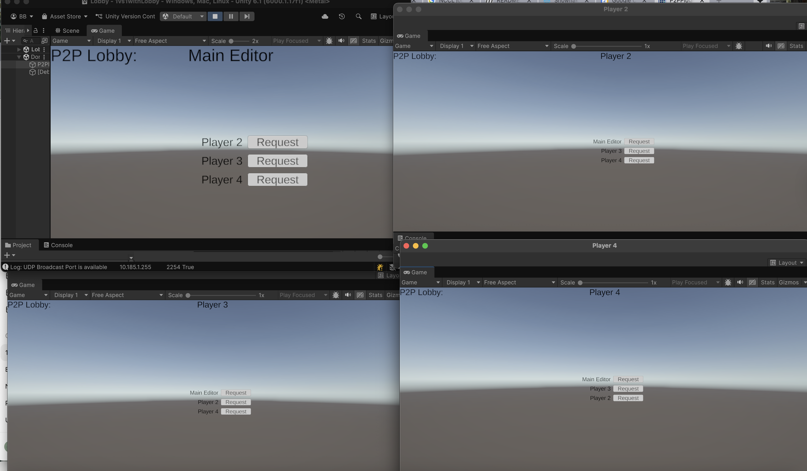
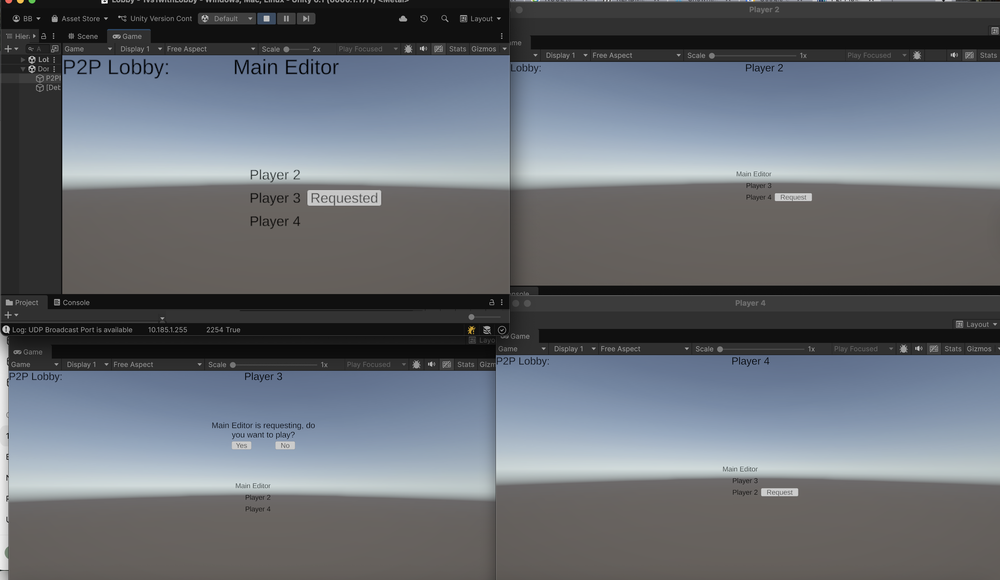
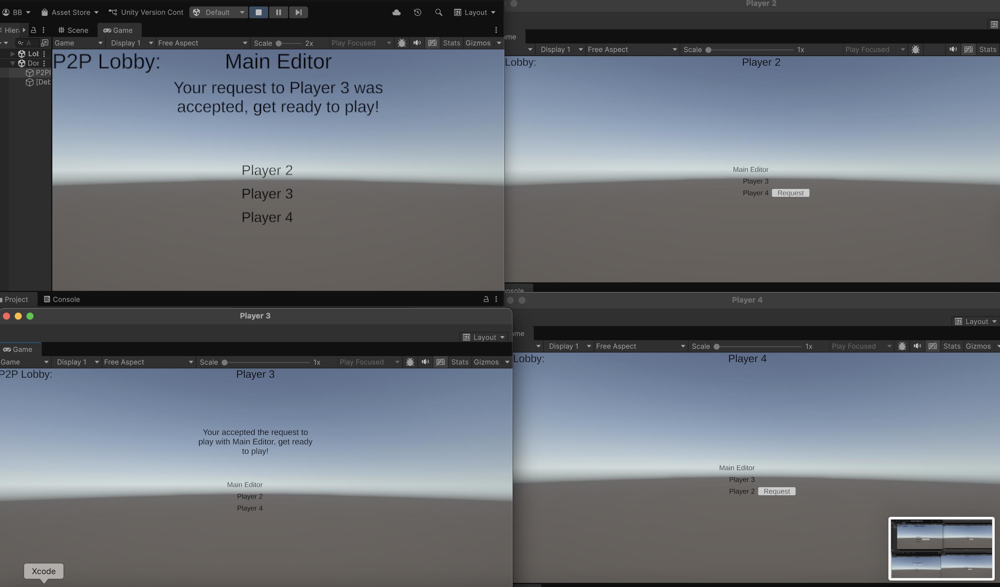
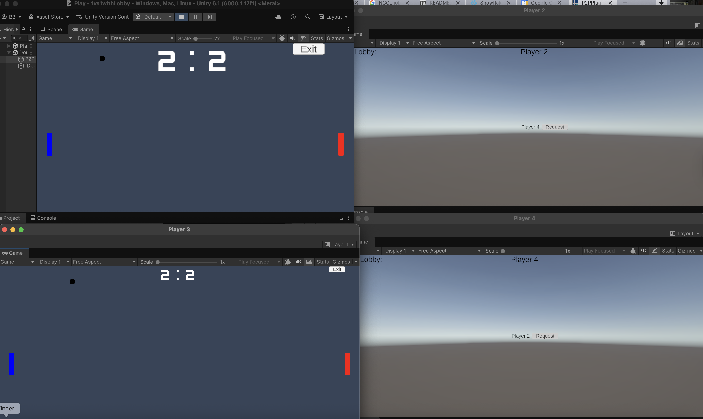

# 1 vs 1 Pong Game With Lobby Example #

## Interactive README

<b><a href="https://blainebell.org/1vs1withLobby/README.html" target="_blank">An interactive version of this page</a></b> is available online.  Code blocks in the implementation section are interactive and show the related code from the psuedo-code in a split screen on the left.

## Overview

The 1 vs 1 Pong Game with Lobby project is a Unity-based example demonstrating how to build a two-player game with an integrated lobby system that demonstrates the <a href="https://blainebell.org/P2PPlugin/README.html" target="_blank">Unity Peer-to-Peer Networking Plugin</a>.  This demo shows how to setup peer-to-peer logic on the local network without the need of a server.

The key goals are:

- **P2P Lobby**: Allow two players to connect through a lobby before the match begins.
- **P2P Game Play**: Game communicates only between the two players' devices.
- **Basic Codebase**: Clean, modular example code in Unity (C#) that can be extended for use in any game.

This example serves as a reference / starting point for peer-to-peer multiplayer games with basic networking and UI-flow.  It can certainly be extended to more than 2 players, and the game can easily be modified to start right away without the need of interaction in the Lobby.

<table style="border: none;width:100%; margin: auto;">
<tr style="border: none;">
<td style="border: none; width: 50%;">

P2P Lobby with 4 peers
</td>
<td style="border: none; width: 50%">

P2P Lobby where peer asks another to play

</td>
</tr>

<tr style="border: none;">
<td style="border: none; width: 50%;">

P2P Lobby where peer has accepted a request to play

</td>
<td style="border: none; width: 50%;">

P2P where two peers are playing, other peers are still in Lobby

</td>
</tr>
</table>

